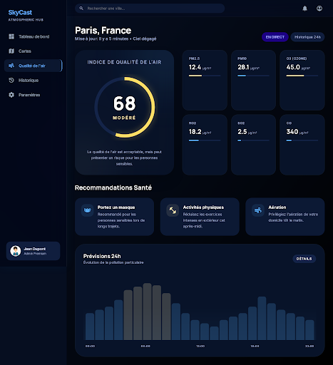
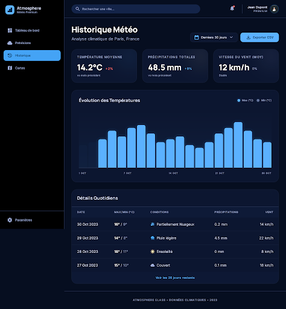
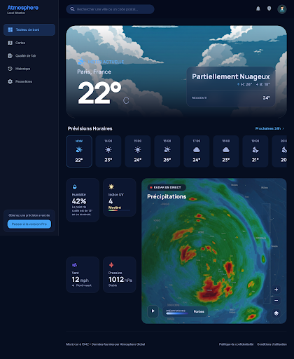
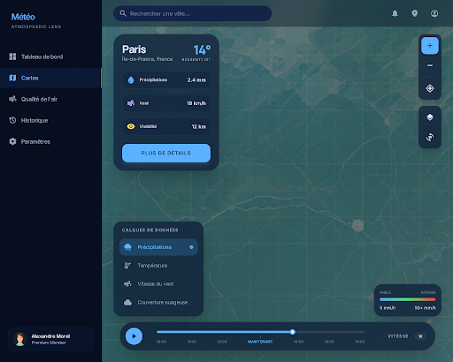
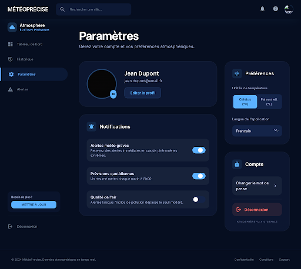

# DESIGN.md — Projet Stitch 13966394804484711469

Exporté automatiquement depuis Google Stitch

---

## Qualité de l'Air (Web)
- **ID** : `6007891daffa481bba5c7779074ea9e6`
- **Device** : DESKTOP — 2560x2804px
- **HTML** : `html/qualité_de_lair_web.html`
- **Screenshot** : `screenshots/qualité_de_lair_web.png`
  

## Historique Météo (Web)
- **ID** : `774d9dc6afa34241820c88197fcff4ab`
- **Device** : DESKTOP — 2560x2764px
- **HTML** : `html/historique_météo_web.html`
- **Screenshot** : `screenshots/historique_météo_web.png`
  

## Qualité de l'Air (Web)
- **ID** : `7aecf87d39a040718caea4b427ef8e93`
- **Device** : DESKTOP — 1280x1024px
- **HTML** : `html/qualité_de_lair_web.html`

## Qualité de l'Air (Web)
- **ID** : `e4bca411f382471b8af4de6fdb49b647`
- **Device** : DESKTOP — 1280x1024px
- **HTML** : `html/qualité_de_lair_web.html`

## Paramètres Web
- **ID** : `56ea0977c12f44c4bf7227922bfd6e4f`
- **Device** : MOBILE — 390x884px
- **HTML** : `html/paramètres_web.html`

## Historique Météo (Web)
- **ID** : `35e1c85defaf4d45b0d313067481fcb9`
- **Device** : DESKTOP — 1280x1024px
- **HTML** : `html/historique_météo_web.html`

## Tableau de bord Météo (Nav)
- **ID** : `50e00282914a4a16b295f710515a5e86`
- **Device** : DESKTOP — 2560x3118px
- **HTML** : `html/tableau_de_bord_météo_nav.html`
- **Screenshot** : `screenshots/tableau_de_bord_météo_nav.png`
  

## Cartes Météo Interactives
- **ID** : `13f015034d044f939a054ba152c070d7`
- **Device** : DESKTOP — 2560x2048px
- **HTML** : `html/cartes_météo_interactives.html`
- **Screenshot** : `screenshots/cartes_météo_interactives.png`
  

## Tableau de bord Météo
- **ID** : `9e5a2e2fa5914700aab833ab4bdb4825`
- **Device** : MOBILE — 390x884px
- **HTML** : `html/tableau_de_bord_météo.html`

## Paramètres Web
- **ID** : `34045ad9a2084c919d2ef04794af5555`
- **Device** : DESKTOP — 2560x2290px
- **HTML** : `html/paramètres_web.html`
- **Screenshot** : `screenshots/paramètres_web.png`
  

## Tableau de bord Météo (Nav)
- **ID** : `2c23dcbef3dc4e179f8f42027a8687e3`
- **Device** : MOBILE — 390x884px
- **HTML** : `html/tableau_de_bord_météo_nav.html`
